### 第一章：前端工程化主要解决的问题

- 传统语言或语法的弊端；
- 无法使用模块化 / 组件化；
- 重复的机械工作；
- 代码风格统一、质量保证；
- 依赖后端服务接口支持；
- 整体依赖后端项目；

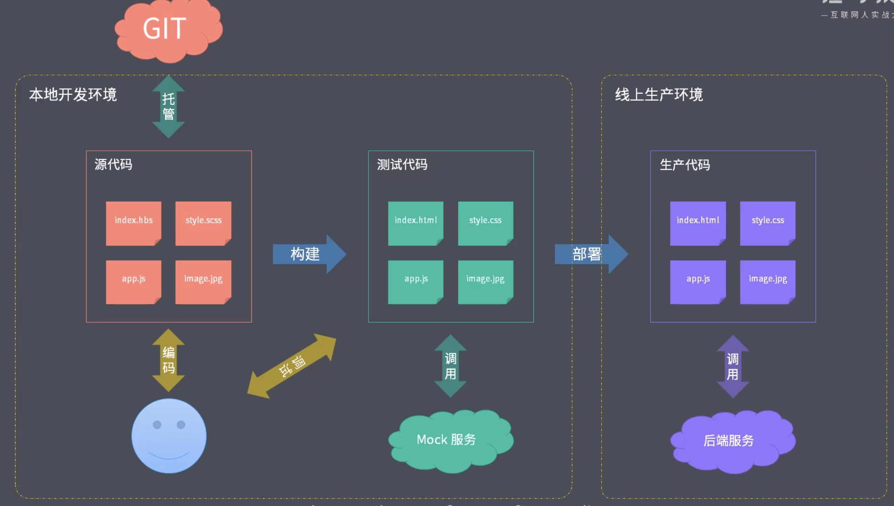

前端工程化的内容概况：

- 脚手架工具开发；
- 自动化构建系统；
- 模块化打包；
- 项目代码规范化；
- 自动化部署；

### 第二章：脚手架工具开发

- 概要：

  - 相同的组织结构；
  - 相同的开发范式；
  - 相同的模块依赖；
  - 相同的工具配置；
  - 相同的基础代码；

- 脚手架工具的作用：

  - 

- 常用的脚手架工具：

  - React 项目 --> create-react-app；
  - Vue 项目 --> vue-cli;
  - Angular 项目 --> angular-cli;
  - Yeoman （通用型脚手架工具）灵活、易扩展；
  - Plop （创建特定类型的文件，例如创建一个组件 / 模块所需要的文件）

- 通用脚手架工具剖析：

  - Yeoman （通用型脚手架工具）灵活、易扩展

  

  - Yeoman 常规使用步骤：

    1. 明确需求；
    2. 找到合适的 Generator；
    3. 全局范围安装找到的 Generator；
    4. 通过 Yo 运行对应的 Generator；
    5. 通过命令行交互填写选项；
    6. 生成所需要的项目结构；

    - 自定义 Generator：

      1. Generator 基本结构：

      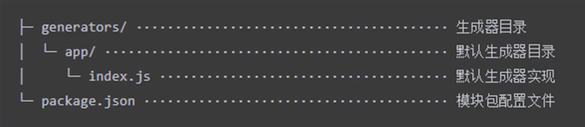

      

      2. Generator 模块名称：

         必须是：generator-<name>

      3. 根据模版创建文件：（提升文件创建的效率）

      4. 发布 Generator：

         1. 创建 generator 模块，
         2. 创建 git 仓库；
         3. 推送到远程 GitHub，
         4. 通过 npm publish 或 yarn publish 发布到 npm 仓库；
         5. 使用：
            1. 可以通过 npm 或 yarn 下载使用 yeoman 

  - npm 镜像加速源：

  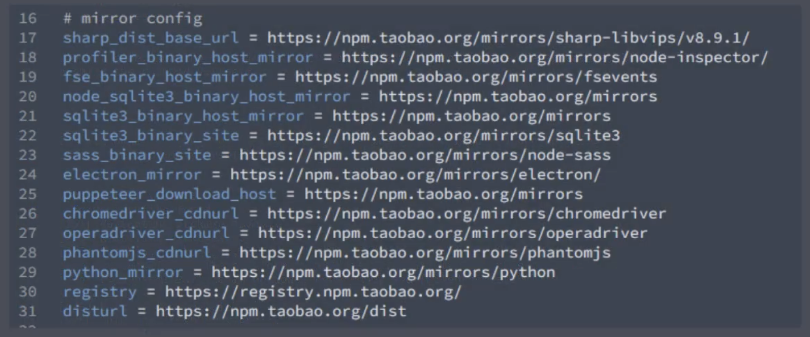

- 开发一款脚手架：

- Plop 小而美的脚手架工具：

  - 提高创建重复文件的效率

  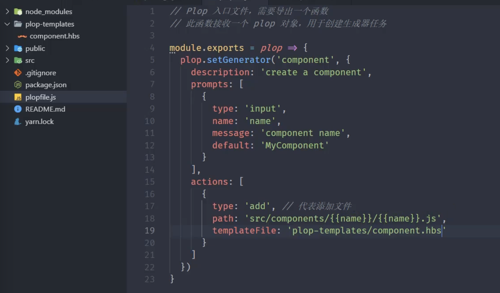

  - 使用 Plop 的步骤：
    1. 将 plop 模块作为项目开发依赖安装；
    2. 在项目根目录下创建一个 plopfile.js 文件；
    3. 在 plopfile.js 文件中定义脚手架任务；
    4. 编写用于生成特定类型文件的模版；（plop-templates / xxx.hbs）
    5. 通过 plop 提供的 cli 运行脚手架任务；
       - yarn plop xxx（生成器任务名）

- CLI 脚手架：

  ```javascript
  // Node CLI 应用入口文件必须要有这样的文件头
  // 如果 Linux 或者 macOS 系统下还需要修改此文件的读写权限为 755
  // 具体就是通过 chmod 755 cli.js 实现修改；
  
  /**
   * 脚手架的工作过程：
   * 1.通过命令行交互询问用户问题
   * 2.根据用户回答的结果生成文件
  */
  
  const fs = require('fs')
  const path = require('path')
  const inquirer = require('inquirer')
  const ejs = require('ejs')
  
  inquirer.prompt([
      {
          type:'input',
          name:'name',
          message: 'Project name ?'
      }
  ])
  .then(anwsers =>{
      // 根据用户回答的结果生成文件
      // 模版目录
      const templDir = path.join(__dirname, 'templates')
      // 目标目录
      const destDir = process.cwd()
      // 将模版目录下的文件全转换到目标目录
      fs.readFile(templDir, (err, files) => {
          if(err) throw err
          files.forEach(file => {
              ejs.readFile(path.join(templDir, file), anwsers, (err, result) => {
                  if(err) throw err
                  // 将结果写入目标文件路径中
                  fs.writeFileSync(path.join(destDir, file), result)
              })
          })
      })
  })
  ```

### 第三章：自动化构建系统


- 自动化构建的作用：

  1. 脱离运行环境兼容带来的问题；
  2. 在开发阶段，使用提高效率的语法、规范和标准；

- NPM Script 方式，包装构建命令：

  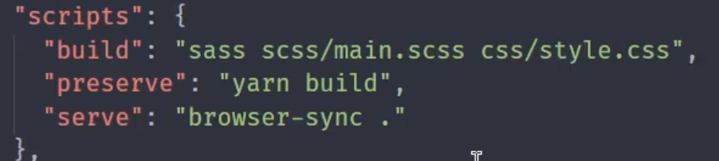

  - “build”：“sass  sass/main.scss  css/style.css  --watch”

  - “preserve ”：“yarn build”  //  启动本地服务器前自动先构建（build）一下

  - “serve”：“browser-sync  .  --files  \"css/*.css\ ”  // 本地静态服web务器

    --files：监听项目下文件的变化，而实时同步更新浏览器中的变化效果，更改完成后避免手动刷新浏览器。

  - “start”：“run-p build serve” // 同时构建后启动静态服务且实时监听文件变化

- 常用的构建工具：

  - Grunt：

    - 工作过程是基于临时文件去实现的，所以构建速度相对较慢；
    - 先编译 => 自动添加私有属性前缀 => 压缩代码；（消耗磁盘读写操作）
    - return flase // 标记失败任务，且后面的任务不在执行；
    - grunt 插件使用：
      1. 通过 npm 安装插件；
      2. 再到 gruntfile.js 中载入插件；（grunt.loadNpmTasks(‘grunt-contrib-clean’)）
      3. 根据插件的文档，完成配置选项；（grunt.initConfig()）
      4. *grunt-contrib-watch* 插件：文件修改完后自动编译

  - Gulp：

    - 基于内存实现的，文件处理环节都是在内存中实现的；相对磁盘读写快了很多；

    - 默认支持同时执行多个任务；

    - 基本使用：

      - 导出函数的方式实现 gulp 任务

      ```javascript
      exprots.foo = done => {
        console.log('foo task working')
        done() // 标识任务结束
      }
      // 默认任务
      exports.default = done => {
        console.log('default task working')
        done() // 标识任务结束
      }
      ```

      - 4.0 之前的版本

      ```javascript
      const gulp = require('gulp')
      gulp.task('bar', done => {
        console.log('bar task working')
        done() // 标识任务结束
      })
      ```

    - 组合任务 API：

      - series ：串行任务
      - parallel ：并行任务

    - 异步任务的三种方式：

      1. 通过回调的函数的方式（callback）；
      2. promise 方式；需要return Promise 对象；
      3. async / await 函数方式；

    

    - 封装自动化构建工作流：

    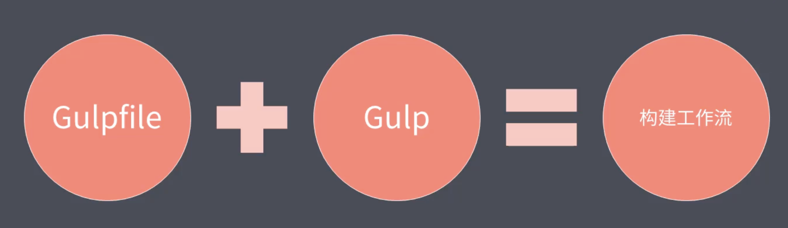

    1. 创建自定义 gulp 模块；
    2. 将模块发布到 npm 仓库；
    3. 在项目中使用创建的模块；

  - FIS：（百度前端团队推出的构建系统）

    - 更像是捆绑，典型的需求集成在内部；
    - 资源加载
    - 模块化开发
    - 代码部署
    - 性能优化

### 第四章：模块化打包

- 模块化的演变过程

  - Stage1 => 文件划分方式；

    缺点：

    1. 污染全局作用域；
    2. 命令冲突问题；
    3. 无法管理模块依赖关系；

  - Stage2 => 命令空间方式；

    优点：

    1. 减小命令冲突问题；

    缺点：

    1. 没有私有化，私有空间；
    2. 无法管理模块依赖关系；

  - Stage3 => IIFE（立即执行函数）；

    优点：

    1. 私有作用域，暴露一个全局对象；
    2. 自执行函数的参数作为依赖声明，依赖关系明确了；

    缺点：

    1. 闭包的私有成员难以得到释放；内存占用；

- 模块化规范

  - node端：CommonJS 规范：**<font color = 'red'>是以同步模式加载模块</font>**

    1. 每一个文件就是一个模块；
    2. 每个文件都有单独的作用域；
    3. 通过 module-expert 导出成员；
    4. 通过 require 函数载入模块；

  - 浏览器端：

    1. Require.js：（AMD [Asynchronous Module Definition]）异步定义模块规范（依赖前置）

       定义模块：

    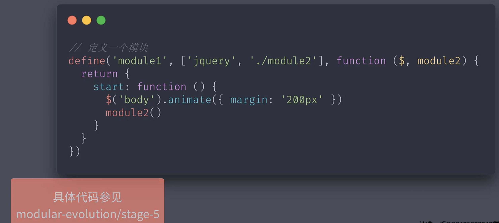

    ​	  加载模块：

    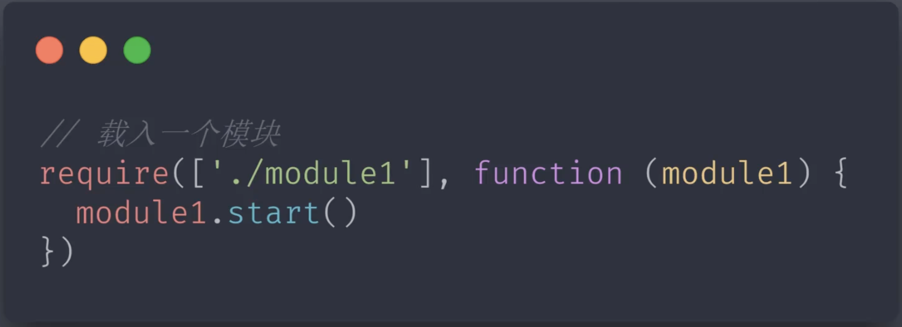

    2. Sea.js：（CMD [Common Module Definition]）（依赖后置-在callback中 require 载入）

    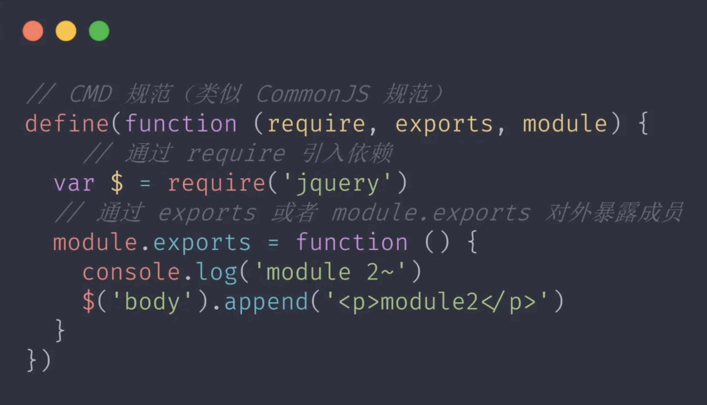

  - 现阶段统一两种规范：

    - 浏览器端：（ESModule）

      - ESModule 语法特性：
        1. 通过给 script 添加 type = module 的属性，就可以以 ES Module 的标准执行其中的 JS 代码了；
        2. ESM 自动采用严格模式，忽略 “ use strict ”；this = undefined；
        3. 每个 ESM 都是运行在单独的私有作用域中；
        4. ESM 是通过 CORS 的方式请求外部 JS 模块的；（跨域问题）
        5. ESM 的 script 标签会默认延迟执行脚本；（defer 属性）

      ```javascript
      // ./module.js
      const foo = 'es modules'
      export { foo } // 导出
      // ./app.js
      import { foo } from './module.js' // 导入
      console.log(foo) // => es modules
      ```

      - ESModule 导入导出的注意事项：

        1. export { name, age } 不是对象字面量的导出。而是ESModule 导出的固定语法；export default { name, age } 是导出对象和对象字面量；

        2. ESModule 导出成员是这个成员的引用，对外暴露的是只读的；

        3. 导入模块不能嵌套在 if 语句和函数中导入，只能在最顶层导入；

        4. import(‘./xx.js’) 函数动态导入模块，返回的是 promise ；

        5. 命名成员和默认成员同时导入导出，默认成员需要重命名导入；

           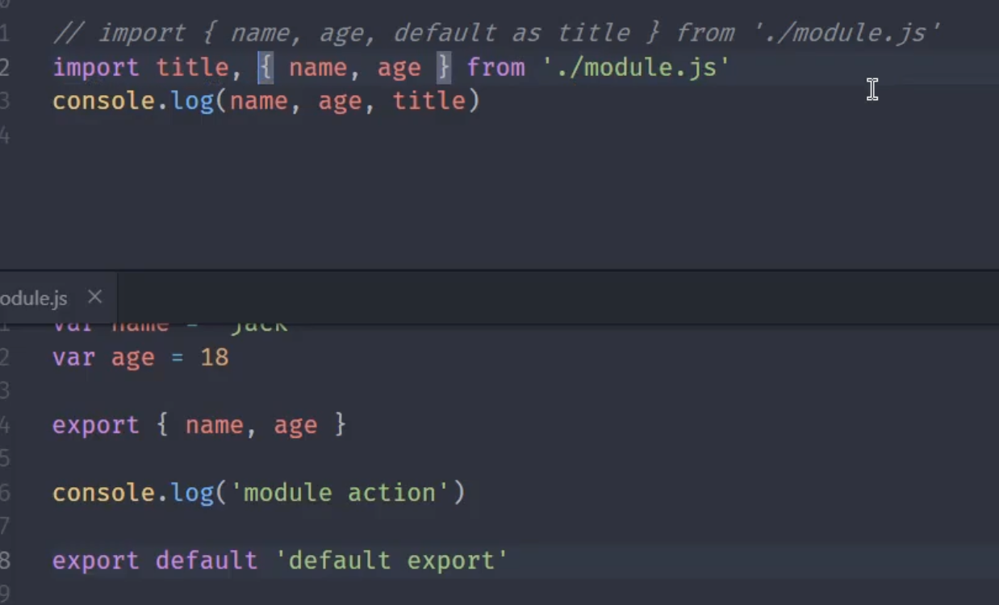

      - Polyfill 兼容方案：

        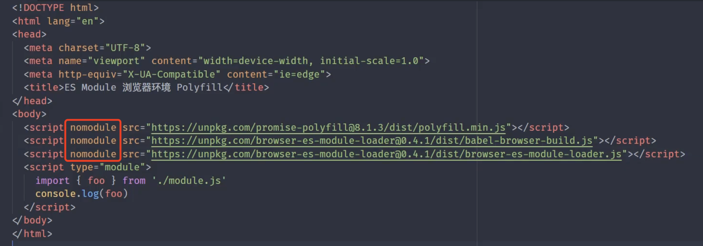

        - nomodule 的属性是在支持 ESModule 的浏览器环境中，不需 Polyfill ；避免在支持 ESModule 的浏览器中执行两次；
        - 此方式只适合本开发地测试，不适合生产阶段，因为它的原理是动态的去解析脚步，效率低。在生产阶段，我们还是会先编译出来，再到浏览器中工作；

    - node 端：（CommonJS）8.5+版本已经开始支持 ESModule

      - 在 node 环境中启动 ESModule 的环境代码

        ```shell
        # --experimental-modules 通过 ESModule 执行
        node --experimental-modules index.mjs
        ```

      - 不支持解构导出成员，因为第三方模块都是导出默认成员；

      - 可以支持系统内置模块的成员提取；

        ```javascript
        // 系统内置模块，官方兼容了 ESM 的提取成员方式
        import { writeFileSync } from 'fs';
        writeFileSync('./bar.txt', 'ES module working');
        ```

      - CommonJS 模块始终只会导出一个默认成员；

      - ES Modules 中可以导入 CommonJS 模块；

      - import 不能直接提取 CommonJS 中的成员，import 不是解构导出对象，只是一个固定用法，是提取模块中导出的命名成员；

      - 在 node 原声环境中，不能在 CommonJS 模块中通过 require 载入 ES Module；

      - ES Modules 在 node 环境中与 CommonJS 模块的差异：

        ```shell
        nodemon --experimental-modules esm.mjs
        ```

        ```javascript
        // 模块内置的全局变量 commonJS 中；
        // 加载模块函数
        consloe.log(require);
        // 模块对象
        consloe.log(module);
        // 导出对象别名
        consloe.log(exports);
        // 当前文件的绝对路径
        consloe.log(__filename);
        // 当前文件所在目录
        consloe.log(__dirname);
        ```

        1. 在 ES Module 中没有 CommonJS 中的那些模块的全局成员了；

        2. node 的 新版本中进一步支持了 ES Module 

           ```shell
           # 切换 node 版本
           nvm use 12.10.0
           node --version
           ```

      - babel (node 环境中通过 babel 兼容方案)

        

        ```shell
        yarn babel-node index.js --presets=@babel/preset-env
        ```

        添加 .babelrc 文件；

        ```json
        {
        	"presets": ["@babel/preset-env"]
        }
        // 或着 安装 yarn add @babel/plugin-transform-modules
        {
          "plugins": [
            "@babel/plugin-transform-modules"
          ]
        }
        ```

- 常用模块化打包工具

  -  新特性代码编译
  - 模块化 javascript 打包
  - 支持不同类型的资源模块
  - 主流工具
    1. Webpack；
    2. Parcel；
    3. Rollup；

- 基于模块化工具构建现代web应用

- 打包工具的优化技巧

### 第五章：项目代码规范化

- 代码、文档、甚至是提交日志

- 开发过程中人为编写的成果物

- 代码标准化规范最为重要

- 通过工具实现 Lint

- 常见的规范化实现方式（ESLint工具 🔧）

  - ESLint 工具使用
  - 定制 ESLint 校验规则
  - ESLint 对 TypeScript 的支持
  - ESLint 结合自动化工具或者 Webpack
  - 基于 ESLint 的衍生工具
  - Stylelint 工具的使用

- ESLint 介绍：

  - 最为主流 的 javascript Lint 工具监测 JS 代码质量
  - ESLint 很容易统一开发者的编码风格
  - ESLint 可以帮助开发者提升编码能力

- ESLint 安装：

  - 初始化项目

  - 安装 ESLint 模块为开发依赖

  - 通过 CLI 命令验证安装结果

    ```shell
    # 安装ESLint 
    yarn add eslint --save-dev
    # 查看 ESLint 的版本
    npx eslint --version
    ```

- ESLint 快速上手：

  - ESLint 检查步骤：
    - 编写“问题”代码；
    - 使用 ESLint 执行检测
    - 完成 ESLint 使用配置

  ```shell
  # ESLint 执行检测
  npx eslint index.html
  # 自动修复问题代码
  npx eslint index.html --fix
  ```

- ESLint 配置文件解析

  ```javascript
  // .eslintrc.js
  module.exports = {
      "env": { // 标记当前代码运行中的环境
          "browser": true,
          "es2021": true,
          "node": true
      },
    	// 可以同时继承多个共享配置
      "extends": [
          "standard" // 继承 standard 的风格配置
      ],
    	// 设置语法解析器的配置
      "parserOptions": {
          "ecmaVersion": 13
      },
    	// 配置每个校验规则的开启或关闭
      "rules": {
        "no-alert": "error" // 'off', 'wraing', 'error'
      },
    	"globals":{ // 额外的在代码中配置全局成员使用
        "jQuery": "readonly"
      }
  };
  ```

  - env 属性所对应的全局环境（环境不是互斥的，可以同时开启多个环境）

    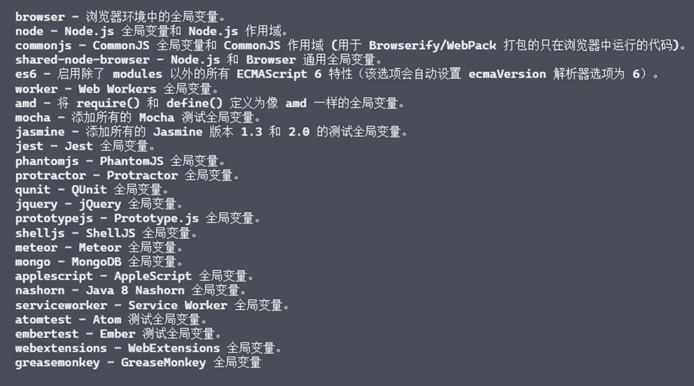

- ESLint 配置注释：

  - 注释语法：

  ```javascript
  // eslint-disable-line [具体的规则名称：no-template-curly-in-string] 表示忽略单行代码检测规则
  ```

- ESLint 结合 Gulp 自动化工具：

  - pipe(pligins.eslint())  // 启用 ESLint 检测代码中的问题
  - pipe(pligins.eslint.format()) // ESLint 处理完成后在控制台打印具体的错误信息
  - pipe(pligins.eslint.failAfterError()) // 检测 ESLint 中的错误后终止任务管道

- ESLint 结合 Webpack 构建工具：

  - ESLint 通过 loader 机制集成到 webpack 中
  - 安装 eslint-loader 模块
  - 初始化 .eslintrc.js 配置文件

- ESLint 结合 TypeScript 使用

  ```javascript
  // .eslintrc.js
  module.exports = {
      "env": { // 标记当前代码运行中的环境
          "browser": true,
          "es2021": true,
          "node": true
      },
    	// 可以同时继承多个共享配置
      "extends": [
          "standard" // 继承 standard 的风格配置
      ],
    	// 作用是指定一个语法解析器
    	"parser": "@typescript-eslint/parser",
    	// 设置语法解析器的配置
      "parserOptions": {
          "ecmaVersion": 13
      },
    	// 配置每个校验规则的开启或关闭
      "rules": {
      },
    	"plugins": [
        "@typescript-eslint"
      ]
  };
  ```

- Stylelint 的认识：

  - 提供默认的代码检查规则
  - 提供 CLI 工具，快速调用
  - 通过插件支持 Sass、Less、PostCSS
  - 支持 Gulp 或 Webpack 集成

  ```shell
  # 安装 stylelint 
  yarn add stylelint --save-dev
  # 添加 .stylelint.js 配置文件
  # 安装 stylelint 共享配置文件
  yarn add stylelint-config-standard --save-dev
  # 安装 stylelint-config-sass-guidelines 的 sass 模块
  yarn add stylelint-config-sass-guidelines --save-dev
  # 使用 stylelint 检查
  npx stylelint ./index.css
  ```

  ```javascript
  // .stylelint.js 配置文件
  module.exports = {
    // 继承配置模块
    extends: ['stylelint-config-standard', 'stylelint-config-sass-guidelines']
  }
  ```

- Prettier 的使用：
  - 

### 第六章：自动化部署


### 其他

- node cli 程序的权限问题（Linux）


- chmod 755 cli.js； chmod +x cli.js；
