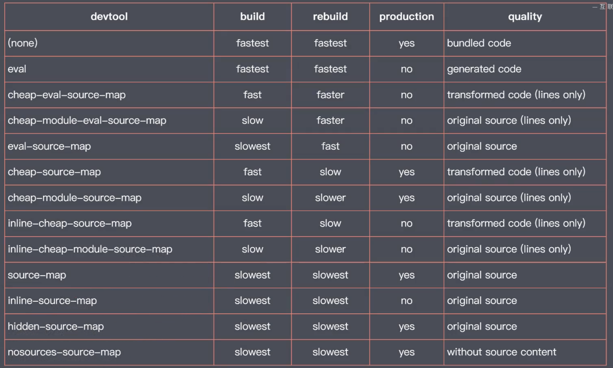

### 第一章：概述

模块打包工具（Module Bundler）=> 模块加载器（Loader） =>  代码拆分（Code Splitting）=> 资源模块（Asset Module）

### 第二章：配置文件

- webpack.config.js 
  
  ```javascript
  const path = require('path')
  const webpack = require('webpack')
  const { CleanWebpackPlugin } = require('clean-webpack-plugin')
  const HtmlWebpackPlugin = require('html-webpack-plugin')
  const CopyWebpackPlugin = require('copy-webpack-plugin')
  // 自实现一个 plugin
  class MyPlugin {
    // webpack 启动时，会自动调用
    apply (compiler) {
      // compiler 核心的对象参数
      console.log('MyPlugin 启动')
      compiler.hooks.emit.tap('MyPlugin', compilation => {
        // compilation => 可以理解为此次打包的上下文
        for(const filename in compilation.assets){
          // console.log(filename) 获取文件名
          // console.log(compilation.assets[filename].source()) // 获取文件中的内容
          if(filename.endsWith('.js')){
            const contents = compilation.assets[filename].source()
            const withoutComments = contents.replace(/\/\*\*+\*\//g, '')
            compilation.assets[filename] = {
              source: () => withoutComments,
              size: () => withoutComments.length
            }
          }
        }
      })
    }
  }
  
  module.exports = {
    mode: 'development' // development 模式：（开发模式）\ production 模式：（生产模式）\ none 模式：（原始打包模式）
    entry: './src/main.js', // 打包的入口文件
    output： {
        filename: 'bundle.js', // 打包后的输出文件名
        path: path.join(__dirname, 'dist'), // 打包后的输出文件路径
        // publicPath: 'dist/', // '' 表示网站的根目录， 'dist/' 表示项目的目录
      },
     // 集中配置 webpack 内部优化功能 => Tree-shaking 的实现
    optimization: {
      usedExports: true, // 只导出外部使用的成员
      minimize: true, // 开启代码压缩功能
      concatenateModules: true, // 尽可能的将所有模块合并输出到一个函数中
      sideEffects: true, // 模块副作用  package.json 中添加 sideEffects:false
    }
    devtool: 'cheep-module-eavl-source-map',
    devServer: {
      // 开启 HMR 
      // hot: true, 
      // 热更新出现错误不会自动刷新页面
      hotOnly: true, 
      // 为 webpack-dev-server 额外的为开发服务器指定查找资源目录
      contentBase: ['./public'],
      proxy: {
        '/api': {
          // http://localhost:8080/api/users => https://api.github.com/api/users
          target: 'https://api.github.com',
            // http://localhost:8080/api/users => https://api.github.com/users
          pathRewrite: {
            '^/api': ''
          },
           // 不能使用 localhost:8080 作为请求 github 的主机名
          changeOrigin: true
        },
      }
    },
    module: {
      rules: [
        {
          test: /.js$/,
          use: {
            loader: 'babel-loader',
            options: {
              presets: ['@babel/preset-env']
            }
          }
        },
        {
          test: /.css$/,
          use: [
            'style-loader',
            'css-loader'
          ]
        },
        /** 
        {
          test: /.png$/,
          use: 'file-loader'
        },
        */
        {
          test: /.png$/,
          use: 'url-loader',
          options: {
            limit: 10*1024  // 10KB
          }
        },
        {
          test: /.html$/,
          use: {
            loader: 'html-loader',
            options: {
              attrs: ['img:src', 'a:href']
            }
          }
        }
      ]
    },
    plugins: [
        new CleanWebpackPlugin(),
      // 用于生成 index.html
      new HtmlWebpackPlugin({
        title: 'webpack plugin sample',
        meta: {
          viewport: 'width=device-width'
        },
        template: './src/index.html'
      }),
      // 用于生成 about.html
      new HtmlWebpackPlugin({
        filename: 'about.html',
      }),
      // 开发过程中不需要使用此插件，在生产过程中需要copy静态资源到生产目录
      new CopyWebpackPlugin([
        // 'public/**'
        'public'
      ]),
      // 移除 生成 js 文件中的注释插件 
      new MyPlugin(),
      // 热更新插件
      new webpack.HotModuleReplacementPlugin()
    ]
  }
  ```

### 第三章：工作模式

- development 模式：（开发模式）
- production 模式：（生产模式）
- none 模式：（原始打包模式）

### 第四章：打包结果运行原理

- ### 第五章：资源模块加载

- 内部默认的 javascript 文件的 Loader 加载器；

- 其他文件格式的需要 Other Loader 的加载器；

### 第六章：导入资源模块

- 文件资源加载器（file-loader）；
- html-loader：
- Data URLs （url-loader），小文件通过 Data URLs，减少请求次数
- 大文件单独提取存放，提高加载速度；
- 常用加载器分类：
  - 编译转换类：
    - babel-loader：处理代码中的新特性
  - 文件操作类：
  - 代码检查类：
- 遵循模块化标准：
  - 遵循 ES Modules 标准的 import 声明；
  - 遵循 CommonJS 标准的 require 函数；
  - 遵循 AMD 标准的 define 函数和 require 函数；
  - <font color='hotpink' font-weight=700>样式代码中的 @import 指令和 url 函数</font>；
  - <font color='hotpink' font-weight=700>HTML 代码中的图片标签的 src 属性</font>

### 第七章：核心工作原理

概述：一般在我们的项目当中，散落着一些资源文件，webpack 会根据我们的配置，找到其中的一个文件，作为打包的入口，一般入口文件是一个 js 文件，然后顺着我们入口文件中的代码，根据代码中出现的 import 或者 require 之类的语句，然后解析推断出来这个文件所依赖的资源模块，然后分别去解析每一个资源模块对应的依赖，最后形成了整个项目中所以用到文件之间关系的一个依赖树，有了依赖树关系后，webpack 会去遍历（**<font color='red'>递归</font>**）这个依赖树，然后找到每个节点所对应的资源文件，最好根据我们配置文件当中的 **rules** 属性，去找到这个模块所对应的加载器，然后交给对应的加载器去加载对应的模块，最后会将加载到的结果放入到 bundle.js 中，也就是打包结果当中，从而去实现我们整个项目的打包。

- loader 机制是 webpack 的核心；


- loader 的工作原理：（示例：markdown-loader.js）
  
  专注实现资源模块的加载
  
  ```javascript
  const marked = require('marked')
  module.exports = source => {
    // 通过 source 参数接收 输入， 通过返回值，去输出,且返回值必须是 js 代码 或是 其他的loader （other loader）
    // console.log(source);
    const html = marked(source)
    // return `module.exports = ${JSON.stringify(html)}`
    // 支持 ES Module 方式导出
    return `export default ${JSON.stringify(html)}`
    // return 'console.log("hello ~")'
  }
  ```
  
  1. loader 负责资源文件从输入到输出到转换；
  2. loader 是个管道 （pie）的概念；
  3. 对同一个资源可以依次使用多个 loader；

- webpack 的插件机制：（Plugin）
  
  Plugin 解决项目中自动化工作
  
  - 目的是增强 webpack 的项目自动化能力；
  - 例如：清除 dist 目录，拷贝静态文件至输出目录，压缩输出代码；
  - clean-webpack-plugin：自动清除输出目录的插件
  - html-webpack-plugin：自动生成使用 bundle.js 的 html；
  - copy-webpack-plugin：自动将静态资源拷贝到打包目录中；
  
  Plugin 通过钩子机制实现的：
  
  - webpack-plugin 必须是一个函数或者是一个包含 apply 方法的对象；
  
  - 通过在 webpack 生命周期的钩子中挂载任务函数实现扩展

### 第八章：webpack 中开发体验问题

1. 以 HTTP Server 运行；

2. 自动编译 + 自动刷新；

3. 提供 Source Map 支持；
- 实现自动编译：
  
  webpack-cli 提供的 watch 工作模式：监听文件变化，自动重新打包

- 实现自动刷新：
  
  BrowserSync 工具  //1、 操作麻烦；2、效率上降低了；3、磁盘读写操作两次；

- Webpack Dev Server：
  
  - 提供了用于开发的 HTTP Server；
  - 集成【自动编译】和【自动刷新浏览器】；
  - 打包结果存在内存中；减少磁盘操作；
  - 默认会将构建结果输出的文件，全部作为开发服务（server）的资源文件；只要是 webpack 输出的文件，都可以被直接访问；其他静态资源文件也需要额外的配置 Dev Server；
  - devServer : { contentBase: ['./public'] } 为 webpack-dev-server 额外的为开发服务器指定查找静态资源目录；
  - 支持配置代理服务：proxy

- Source Map：
  
  - 映射源代码与转换后代码的关系；
  
  - 解决了源代码与运行代码不一致所产生的调试问题；
  
  - webpack 配置 source map：
    
    - devtool: 'source-map’
    - eval 模式下的 Source Map：
    
    
  
  - 开发环境适合用 cheep-module-eavl-source-map 模式；
  
  - 生产环境适合用 none 模式 / nosource-source-map 模式；
  
- HMR（Hot Module Replacement）模块热更新：解决页面自动刷新导致页面状态丢失的问题；

  ```shell
  webpack-dev-server  --hot
  ```

  - webpack 中的 HMR 需要手动处理模块热替换逻辑；

  - HMR API 的核心对象：(module.hot)

    ```javascript
    module.hot.accept('./editor', () => {
      console.log('edit 模块更新了，需要手动处理热替换逻辑')
    })
    ```

### 第九章：生产环境优化

生产环境注重运行效率；开发环境注重开发效率；webpack 4.0+ 推出 mode 模式用法

1. 配置文件根据环境的不同导出不同配置；（中小型项目）
2. 一个环境对应一个配置文件；（大型项目）

- DefinePlugin 默认插件配置

  - 为代码注入全局成员

  ```javascript
  process.env.NODE_ENV
  ```

- Tree-shaking：删除代码中未引用的部分；未引用代码（dead-code）

  - tree-shaking 不是指某个配置选项

  - 一组功能搭配使用后的优化效果

  - 在 production（生产）模式下自动启用

    - usedExports 负责标记未被引用的代码；
    - minimize 负责移除这些被标记的代码；
    - concatenateModules 尽可能的将所有模块合并输出到一个函数中，即提升了运行效率，又减少了代码的体积（Scope Hoisting）；

  - sideEffects：

    副作用：模块执行时除了导出成员之外所作的事情；

    sideEffects 一般用于 npm 包标记是否有副作用；

    - 确定代码中真的没有副作用

- Code Splitting：代码分包 / 代码分割

  - 多入口打包：多个入口打包输出多个打包结果；
    - Multi Entry：一般适用于传统的多页应用程序
    - 一个页面对应一个打包入口；
    - 公共部分单独提取；
      - Split Chunks：
  - 动态导入：实现模块的按需加载；
    - 动态导入的模块会被自动分包；
  - MiniCssExtractPlugin：提取 CSS 到单个文件；
  - OptimizeCssAssetsWebpackPlugin：压缩输出的 CSS 文件；
  - substitutions：输出文件名 Hash；
    - chunkhash：解决缓存问题的最好方式，精确的定位到文件级别的 hash；
    - contenthash：控制缓存，8位的 contenthash 是最好的方式；
