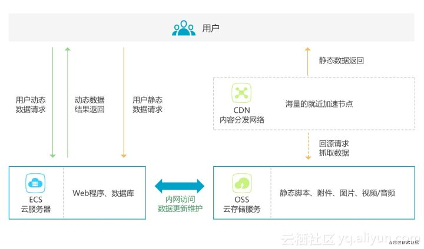
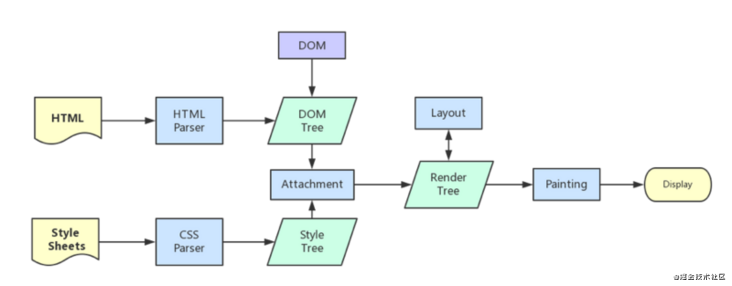
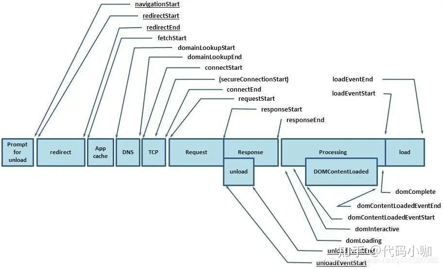

性能优化分为两大类：

- 加载时优化
- 运行时优化

#### 一、加载时性能优化

- 主要解决的就是让一个网站加载过程更快，比如压缩文件大小、使用 CDN 加速等方式可以优化加载性能。检查加载性能的指标一般看：白屏时间和首屏时间：

  - 白屏时间：`指的是从输入网址，到页面开始显示内容的时间。`

    白屏时间计算：

    将代码脚本放在 `</head>` 前面就能获取白屏时间：

    ```javascript
    <script>
        new Date().getTime() - performance.timing.navigationStart
    </script>
    ```

  - 首屏时间：`指从输入网址，到首屏页面内容渲染完毕的时间。`

    首屏时间计算：

    在`window.onload`事件中执行以下代码，可以获取首屏时间：

    ```javascript
    new Date().getTime() - performance.timing.navigationStart
    ```

- 我们知道浏览器如果输入的是一个网址，首先要`交给DNS域名解析 -> 找到对应的IP地址 -> 然后进行TCP连接 -> 浏览器发送HTTP请求 -> 服务器接收请求 -> 服务器处理请求并返回HTTP报文 -> 以及浏览器接收并解析渲染页面`。从这一过程中，其实就可以挖出优化点，缩短请求的时间，从而去加快网站的访问速度，提升性能。

- 这个过程中可以提升性能的优化的点：

  1. DNS解析优化，浏览器访问DNS的时间就可以缩短；
  2. 使用HTTP2；
  3. 减少HTTP请求数量；
  4. 减少http请求大小；
  5. 服务器端渲染；
  6. 静态资源使用CDN；
  7. 资源缓存，不重复加载相同的资源；

	###### 1.1 DNS预解析

- DNS 作为互联网的基础协议，其解析的速度似乎容易被网站优化人员忽视。现在大多数新浏览器已经针对DNS解析进行了优化，典型的一次DNS解析耗费`20-120毫秒`，减少DNS解析时间和次数是个很好的优化方式。`DNS Prefetching`是具有此属性的域名不需要用户点击链接就在后台解析，而域名解析和内容载入是串行的网络操作，所以这个方式能减少用户的等待时间，提升用户体验。

- 浏览器对网站第一次的域名DNS解析查找流程依次为：

  - `浏览器缓存 ->系统缓存 ->路由器缓存 ->ISP DNS缓存 ->递归搜索`

- DNS 预解析的实现：

  - 用`meta`信息来告知浏览器, 当前页面要做DNS预解析:

    ```html
    <meta http-equiv="x-dns-prefetch-control" content="on" />
    ```

  - 在页面`header`中使用link标签来强制对DNS预解析:

    ```html
    <link rel="dns-prefetch" href="http://bdimg.share.baidu.com" />
    ```

  注意：`dns-prefetch`需慎用，多页面重复DNS预解析会增加重复DNS查询次数。

###### 1.2 使用HTTP2

- HTTP2带来了非常大的加载优化，所以在做优化上首先就想到了用HTTP2代替HTTP1。

- HTTP2相对于HTTP1有这些优点：

  1. **解析速度快**：服务器解析 HTTP1.1 的请求时，必须不断地读入字节，直到遇到分隔符 CRLF 为止。而解析 HTTP2 的请求就不用这么麻烦，因为 HTTP2 是基于帧的协议，每个帧都有表示帧长度的字段。

  2. **多路复用**：在 HTTP2 上，多个请求可以共用一个 TCP 连接，这称为多路复用。

     - 当然HTTP1.1有一个可选的`Pipelining`技术，说的意思是当一个HTTP连接在等待接收响应时可以通过这个连接发送其他请求。听起来很棒，其实这里有一个坑，处理响应是按照顺序的，也就是后发的请求有可能被先发的阻塞住，也正因此很多浏览器默认是不开启`Pipelining`的。

     - HTTP1 的`Pipelining`技术会有阻塞的问题，HTTP/2的多路复用可以粗略的理解为非阻塞版的Pipelining。即可以同时通过一个HTTP连接发送多个请求，谁先响应就先处理谁，这样就充分的压榨了TCP这个全双工管道的性能。加载性能会是HTTP1的几倍，需要加载的资源越多越明显。当然多路复用是建立在加载的资源在同一域名下，不同域名神仙也复用不了。

  3. **首部压缩**：HTTP2 提供了首部压缩功能。

     - HTTP 1.1请求的大小变得越来越大，有时甚至会大于TCP窗口的初始大小，因为它们需要等待带着ACK的响应回来以后才能继续被发送。HTTP/2对消息头采用HPACK（专为http/2头部设计的压缩格式）进行压缩传输，能够节省消息头占用的网络的流量。而HTTP/1.x每次请求，都会携带大量冗余头信息，浪费了很多带宽资源。

  4. **服务器推送**：服务端可以在发送页面HTML时主动推送其它资源，而不用等到浏览器解析到相应位置，发起请求再响应。

###### 1.3 减少HTTP请求数量

- HTTP请求建立和释放需要时间。

- HTTP请求从建立到关闭一共经过以下步骤：

  1. 客户端连接到Web服务器；
  2. 发送HTTP请求；
  3. 服务器接受请求并返回HTTP响应；
  4. 释放连接TCP链接；

  这些步骤都是需要花费时间的，在网络情况差的情况下，花费的时间更长。如果页面的资源非常碎片化，每个HTTP请求只带回来几K甚至不到1K的数据（比如各种小图标）那性能是非常浪费的。

###### 1.4 压缩、合并文件

- **压缩文件** -> 减少HTTP请求大小,可以减少请求时间。

- **文件合并 **-> 减少HTTP请求数量。

- 我们可以对html、css、js以及图片资源进行压缩处理，现在可以很方便的使用 webpack 实现文件的压缩：

  ```tex
  js压缩：UglifyPlugin
  CSS压缩：MiniCssExtractPlugin
  HTML压缩：HtmlWebpackPlugin
  图片压缩：image-webpack-loader
  ```

- **提取公共代码**：合并文件虽然能减少HTTP请求数量， 但是并不是文件合并越多越好，还可以考虑按需加载方式（后面第6点有讲到）。什么样的文件可以合并呢？可以提取项目中多次使用到的公共代码进行提取，打包成公共模块。

  可以使用 `webpack4` 的 `splitChunk` 插件 `cacheGroups` 选项。

  ```javascript
  optimization: {
        runtimeChunk: {
          name: 'manifest' // 将 webpack 的 runtime 代码拆分为一个单独的 chunk。
      },
      splitChunks: {
          cacheGroups: {
              vendor: {
                  name: 'chunk-vendors',
                  test: /[\\/]node_modules[\\/]/,
                  priority: -10,
                  chunks: 'initial'
              },
              common: {
                  name: 'chunk-common',
                  minChunks: 2,
                  priority: -20,
                  chunks: 'initial',
                  reuseExistingChunk: true
              }
          },
      }
  },
  ```

###### 1.5 采用svg图片或者字体图标

- 因为字体图标或者SVG是矢量图，代码编写出来的，放大不会失真，而且渲染速度快。字体图标使用时就跟字体一样，可以设置属性，例如 font-size、color 等等，非常方便，还有一个优点是生成的文件特别小。

###### 1.6 按需加载代码，减少冗余代码

- **按需加载**：

  - 在开发SPA项目时，项目中经常存在十几个甚至更多的路由页面， 如果将这些页面都打包进一个JS文件， 虽然减少了HTTP请求数量， 但是会导致文件比较大，同时加载了大量首页不需要的代码，有些得不偿失，**这时候就可以使用按需加载， 将每个路由页面单独打包为一个文件**，当然不仅仅是路由可以按需加载。

  - 根据文件内容生成文件名，结合 import 动态引入组件实现按需加载：

  - 通过配置 `output` 的 `filename` 属性可以实现这个需求。`filename` 属性的值选项中有一个 `[contenthash]`，它将根据文件内容创建出唯一 hash。当文件内容发生变化时，`[contenthash]` 也会发生变化。

    ```javascript
    output: {
        filename: '[name].[contenthash].js',
        chunkFilename: '[name].[contenthash].js',
        path: path.resolve(__dirname, '../dist'),
    },
    ```

- **减少冗余代码**：

  - 一方面避免不必要的转义：`babel-loader`用 `include` 或 `exclude` 来帮我们避免不必要的转译，不转译`node_moudules`中的js文件,其次在缓存当前转译的js文件，设置`loader: 'babel-loader?cacheDirectory=true'`

  - 其次减少ES6 转为 ES5 的冗余代码：Babel 转化后的代码想要实现和原来代码一样的功能需要借助一些帮助函数，比如：

    ```javascript
    class Person {}
    // 会被转换为：
    function _classCallCheck(instance, Constructor) {
      if (!(instance instanceof Constructor)) {
        throw new TypeError("Cannot call a class as a function");
      }
    }
    
    var Person = function Person() {
      _classCallCheck(this, Person);
    };
    // 这里 _classCallCheck 就是一个 helper 函数，如果在很多文件里都声明了类，那么就会产生很多个这样的 helper 函数。
    ```

  - 这里的 `@babel/runtime` 包就声明了所有需要用到的帮助函数，而 `@babel/plugin-transform-runtime` 的作用就是将所有需要 `helper` 函数的文件，从 `@babel/runtime`包 引进来：

    ```javascript
    "use strict";
    var _classCallCheck2 = require("@babel/runtime/helpers/classCallCheck");
    var _classCallCheck3 = _interopRequireDefault(_classCallCheck2);
    
    function _interopRequireDefault(obj) {
      return obj && obj.__esModule ? obj : { default: obj };
    }
    
    var Person = function Person() {
      (0, _classCallCheck3.default)(this, Person);
    };
    ```

  - 这里就没有再编译出 `helper` 函数 `classCallCheck` 了，而是直接引用了`@babel/runtime` 中的 `helpers/classCallCheck`。

    - 安装

    ```shell
    npm i -D @babel/plugin-transform-runtime @babel/runtime
    ```

    - 使用

    ```json
    // 在 .babelrc 文件中
    "plugins": [
        "@babel/plugin-transform-runtime"
    ]
    ```

###### 1.7 服务器端渲染

- `客户端渲染`: 获取 HTML 文件，根据需要下载 JavaScript 文件，运行文件，生成 DOM，再渲染。
- `服务端渲染`：服务端返回 HTML 文件，客户端只需解析 HTML。
  - 优点：首屏渲染快，SEO 好。
  - 缺点：配置麻烦，增加了服务器的计算压力。

###### 1.8 使用 Defer 加载JS

- 尽量**将 CSS 放在文件头部，JavaScript 文件放在底部**。
- 所有放在 `head` 标签里的 CSS 和 JS 文件都会堵塞渲染。如果这些 CSS 和 JS 需要加载和解析很久的话，那么页面就空白了。所以 JS 文件要放在底部，等 HTML 解析完了再加载 JS 文件。
- JS 文件也不是不可以放在头部，只要给 `script` 标签加上 `defer` 属性就可以了，异步下载，延迟执行。

###### 1.9 静态资源使用 CDN

- 用户与服务器的物理距离对响应时间也有影响。把内容部署在多个地理位置分散的服务器上能让用户更快地载入页面, CDN就是为了解决这一问题，在多个位置部署服务器，让用户离服务器更近，从而缩短请求时间。

  

###### 1.10 图片优化

- 雪碧图：「`Sprite`」

  - 在网站上通常会有很多小的图标，不经优化的话，最直接的方式就是将这些小图标保存为一个个独立的图片文件，然后通过 CSS 将对应元素的背景图片设置为对应的图标图片。这么做的一个重要问题在于，页面加载时可能会同时请求非常多的小图标图片，这就会受到浏览器并发 HTTP 请求数的限制。
  - 雪碧图的核心原理在于设置不同的背景偏移量，大致包含两点：
    1. 不同的图标元素都会将 `background-url` 设置为合并后的雪碧图的 uri；
    2. 不同的图标通过设置对应的 `background-position` 来展示大图中对应的图标部分。你可以用 Photoshop 这类工具自己制作雪碧图。当然比较推荐的还是将雪碧图的生成集成到前端自动化构建工具中，例如在 `webpack` 中使用 `webpack-spritesmith`，或者在 `gulp` 中使用 `gulp.spritesmith`。它们两者都是基于 `spritesmith` 这个库。

- 图片懒加载：

  - 一般来说，我们访问网站页面时，其实很多图片并不在首屏中，如果我们都加载的话，相当于是加载了用户不一定会看到图片， 这显然是一种浪费。解决的核心思路就是**懒加载**：实现方式就是先不给图片设置路径，当图片出现在浏览器可视区域时才设置真正的图片路径。

  - 实现上就是先将图片路径设置给`original-src`,当页面不可见时，图片不会加载：

    ```html
    
    ```

  - 通过监听页面滚动，等页面可见时设置图片`src`:

    ```javascript
    const img = document.querySelector('img')
    img.src = img.getAttribute("original-src")
    ```

  - 如果想使用懒加载，还可以借助一些已有的工具库，例如 aFarkas/lazysizes、verlok/lazyload、tuupola/lazyload 等。

- css中图片懒加载：

  - 除了对于 `` 元素的图片进行来加载，在 CSS 中使用的图片一样可以懒加载，最常见的场景就是 `background-url`。

    ```javascript
    .login {
        background-url: url(/static/img/login.png);
    }
    ```

  - 对于上面这个样式规则，如果不应用到具体的元素，浏览器不会去下载该图片。所以你可以通过切换 `className` 的方式，放心得进行 CSS 中图片的懒加载。

#### 二、运行时性能优化

- 运行时性能是指页面运行时的性能表现，而不是页面加载时的性能。可以通过chrome开发者工具中的 Performance 面板来分析页面的运行时性能。关于chrome开发者工具具体如何操作以及如何查看性能，可以看这篇文章性能优化篇——运行时性能分析。

###### 2.1 减少重绘与重排

- 浏览器下载完页面需要的所有资源后， 就开始渲染页面，主要经历这5个过程：

  1. 解析 HTML 生成 DOM 树；
  2. 解析 CSS 生成 CSSOM 规则树；
  3. 将 DOM 树与 CSSOM 规则树合并生成 Render（渲染）树；
  4. 遍历 Render（渲染）树开始布局，计算每一个节点的位置大小信息；
  5. 将渲染树每个节点绘制到屏幕上；

  

- **重排**：当改变DOM元素位置或者大小时， 会导致浏览器重新生成Render树， 这个过程叫重排。

- **重绘**：当重新生成渲染树后， 将要将渲染树每个节点绘制到屏幕， 这个过程叫重绘。

- **重排触发时机**：

  - 重排发生后的根本原理就是元素的几何属性发生改变， 所以从能够改变几何属性的角度入手：
    1. 添加|删除可见的DOM元素；
    2. 元素位置发生改变；
    3. 元素本身的尺寸发生改变；
    4. 内容变化；
    5. 页面渲染器初始化；
    6. 浏览器窗口大小发生改变；

- **重排重绘的二者关系**：**重排会导致重绘， 但是重绘不会导致重排**

- **减少重绘与重排**：

  1. 避免table布局：

     - 不要使用table布局，可能很小的一个改动会造成整个table重新布局。

  2. 分离读写操作：

     - DOM 的多个读操作（或多个写操作），应该放在一起。不要两个读操作之间，加入一个写操作。

     ```javascript
     // bad 强制刷新 触发四次重排+重绘
     div.style.left = div.offsetLeft + 1 + 'px';
     div.style.top = div.offsetTop + 1 + 'px';
     div.style.right = div.offsetRight + 1 + 'px';
     div.style.bottom = div.offsetBottom + 1 + 'px';
     
     
     // good 缓存布局信息 相当于读写分离 触发一次重排+重绘
     var curLeft = div.offsetLeft;
     var curTop = div.offsetTop;
     var curRight = div.offsetRight;
     var curBottom = div.offsetBottom;
     
     div.style.left = curLeft + 1 + 'px';
     div.style.top = curTop + 1 + 'px';
     div.style.right = curRight + 1 + 'px';
     div.style.bottom = curBottom + 1 + 'px';
     ```

  3. 样式集中改变：

     - 不要频发的操作样式，虽然现在大部分浏览器有渲染队列优化，但是在一些老版本的浏览器仍然存在效率低下的问题：

     ```javascript
     // 三次重排
     div.style.left = '10px';
     div.style.top = '10px';
     div.style.width = '20px';
     
     // 一次重排
     el.style.cssText = 'left: 10px;top: 10px; width: 20px';
     ```

     - 或者可以采用更改类名而不是修改样式的方式。

  4. position属性为absolute或fixed：

     - 使用绝对定位会使的该元素单独成为渲染树中 body 的一个子元素，重排开销比较小，不会对其它节点造成太多影响。当你在这些节点上放置这个元素时，一些其它在这个区域内的节点可能需要重绘，但是不需要重排。

###### 2.2 避免页面卡顿

- 我们目前大多数屏幕的刷新率`-60次/s`,浏览器渲染更新页面的标准帧率也为`60次/s` --**60FPS(`frames/pre second`)**, 那么每一帧的预算时间约为`16.6ms ≈ 1s/60`，浏览器在这个时间内要完成所有的`整理工作`，如果无法符合此预算， 帧率将下降，内容会在屏幕抖动， 此现象通常称为**卡顿**。

- 浏览器需要做的工作包含下面这个流程：

  

  首先你用js做了些逻辑，还触发了样式变化，`style`把应用的样式规则计算好之后，把影响到的页面元素进行重新布局，叫做`layout`，再把它画到内存的一个画布里面，`paint`成了像素，最后把这个画布刷到屏幕上去，叫做`composite`，形成一帧。

  这几项的任何一项如果执行时间太长了，就会导致渲染这一帧的时间太长，平均帧率就会掉。假设这一帧花了50ms，那么此时的帧率就为1s / 50ms = 20fps。

  当然上面的过程并不一定每一步都会执行，例如：

  - 你的js只是做一些运算，并没有增删DOM或改变CSS，那么后续几步就不会执行。
  - `style`只改了颜色等不需要重新layout的属性就不用执行`layout`这一步。
  - `style`改了transform属性，在blink和edge浏览器里面不需要layout和paint。

###### 2.3 长列表优化

- **实现虚拟列表**：虚拟列表是一种用来优化长列表的技术。它可以保证在列表元素不断增加，或者列表元素很多的情况下，依然拥有很好的滚动、浏览性能。它的核心思想在于：只渲染可见区域附近的列表元素。下图左边就是虚拟列表的效果，可以看到只有视口内和临近视口的上下区域内的元素会被渲染。

  

- 具体实现步骤如下所示：

  1. 首先确定长列表所在父元素的大小，父元素的大小决定了可视区的宽和高；
  2. 确定长列表每一个列表元素的宽和高，同时初始的条件下计算好长列表每一个元素相对于父元素的位置，并用一个数组来保存所有列表元素的位置信息；
  3. 首次渲染时，只展示相对于父元素可视区内的子列表元素，在滚动时，根据父元素的滚动的`offset`重新计算应该在可视区内的子列表元素。这样保证了无论如何滚动，真实渲染出的dom节点只有可视区内的列表元素；
  4. 假设可视区内能展示5个子列表元素，及时长列表总共有1000个元素，但是每时每刻，真实渲染出来的dom节点只有5个；
  5. 补充说明，这种情况下，父元素一般使用`position：relative`，子元素的定位一般使用：`position：absolute`或`sticky`；

- 除了自己实现外， 常用的框架也有不错的开源实现， 例如：

  1. 基于React的 `react-virtualized`。
  2. 基于Vue 的 `vue-virtual-scroll-list`。
  3. 基于Angular的 `ngx-virtual-scroller`。

###### 2.4 滚动事件性能优化

- 前端最容易碰到的性能问题的场景之一就是监听滚动事件并进行相应的操作。由于滚动事件发生非常频繁，所以频繁地执行监听回调就容易造成JavaScript执行与页面渲染之间互相阻塞的情况。
- 对应滚动这个场景，可以采用`防抖`和`节流`来处理。
- 当一个事件频繁触发，而我们希望间隔一定的时间再触发相应的函数时， 就可以使用节流（throttle）来处理。比如判断页面是否滚动到底部，然后展示相应的内容；就可以使用节流，在滚动时每300ms进行一次计算判断是否滚动到底部的逻辑，而不用无时无刻地计算。
- 当一个事件频繁触发，而我们希望在事件触发结束一段时间后（此段时间内不再有触发）才实际触发响应函数时会使用防抖（debounce）。例如用户一直点击按钮，但你不希望频繁发送请求，你就可以设置当点击后 200ms 内用户不再点击时才发送请求。

###### 2.5 使用 Web Workers

- 前面提到了大量数据的渲染环节我们可以采用虚拟列表的方式实现,但是大量数据的计算环节依然会产生浏览器假死或者卡顿的情况。
- 通常情况下我们CPU密集型的任务都是交给后端计算的,但是有些时候我们需要处理一些离线场景或者解放后端压力,这个时候此方法就不奏效了。
- 还有一种方法是计算切片,使用 setTimeout 拆分密集型任务,但是有些计算无法利用此方法拆解,同时还可能产生副作用,这个方法需要视具体场景而动。
- 最后一种方法也是目前比较奏效的方法就是利用Web Worker 进行多线程编程。
- `Web Worker` 是一个独立的线程（独立的执行环境），这就意味着它可以完全和 UI 线程（主线程）并行的执行 js 代码，从而不会阻塞 UI，它和主线程是通过 `onmessage` 和 `postMessage` 接口进行通信的。
- `Web Worker `使得网页中进行多线程编程成为可能。当主线程在处理界面事件时，`worker` 可以在后台运行，帮你处理大量的数据计算，当计算完成，将计算结果返回给主线程，由主线程更新 DOM 元素。

###### 2.6 写代码时的优化点

- 提升性能，有时候在我们写代码时注意一些细节也是有效果的。

1. 使用事件委托：
   - 绑定的事件越多， 浏览器内存占有就越多，从而影响性能，利用事件代理的方式就可节省一些内存。
2. if-else 对比 switch：
   - 当判定条件越来越多时， 越倾向于使用`switch`,而不是`if-else`。
   - 但是有的情况下`switch`也做不到`if-else`的事情, 例如有多个判断条件的情况下，无法使用`switch`。
3. 布局上使用flexbox：
   - 在早期的 CSS 布局方式中我们能对元素实行绝对定位、相对定位或浮动定位。而现在，我们有了新的布局方式 flexbox，它比起早期的布局方式来说有个优势，那就是性能比较好。

#### 三、页面加载的性能数据有哪些

###### 3.1 网络层：

- 页面域名解析时间
- tcp 时间
- ttfb 时间
- download 时间

###### 3.2 浏览器渲染：

- 页面开始的时间
- DOM Render 的时间
- Pageload 时间

###### 3.3 页面加载详细数据：

- css、js、image、fonts 等消耗的时间

###### 3.4 性能优化的方式和手段

1. 使用分子域名加载资源
2. 使用较近的 CDN 或 DNS 预解析
3. 使用高性能传输方式或方法，http2、quic、gzip...
4. 减少 http 请求的数量，合并公共资源、使用雪碧图、合并代码块、按需加载资源
5. 减少传输总量或加快传输速度
6. 优化图片的加载展示策略，根据网络状况加载图片、图片格式优化、图片展示位置优化
7. 减少 cookie 体积
8. 使用更有效的缓存策略，keep-alive、expiration、max-age...
9. 使用良好的页面布局
10. 合理安排路由策略
11. 减少反复操作 DOM
12. 减少重绘重排
13. 异步加载资源
14. 公用 css
15. 使用 GPU 渲染初始化动画和图层的合成
16. 高校的 js 代码
17. 使用防抖和节流对 UI 进行优化
18. 使用 web worker 加载资源
19. 减少 301、302
20. 试试缓存数据的方法，localStorage、sessionStorage、IndexedDB
21. 无阻塞加载 js，减少并发下载或请求
22. 减少插件中的多语言版本内容
23. 减少布局上的颠簸，减少对临时元素的影响
24. 减少同时的动画
25. 制定弱网精简策略
26. 正对设备制定精简策略
27. 减少页面图层
28. js、css 命名尽量简短
29. 减少 js 全局查找
30. 减少循环和循环嵌套以减少 js 执行时间
31. 减少事件绑定
32. 组件提取、样式提取、函数提取
33. 按照页面变更频率安排资源
34. 减少 iframe
35. 注意页面大小，特别是canvas 的大小和占用内存

#### 四、监控

监控，又分性能监控和错误监控，它的作用是预警和追踪定位问题。

##### 4.1 性能监控

- 性能监控一般利用`window.performance`来进行数据采集。
- 这个 API 的属性`timing`，包含了页面加载各个阶段的起始及结束时间。



```javascript
timing: {
        // 同一个浏览器上一个页面卸载(unload)结束时的时间戳。如果没有上一个页面，这个值会和fetchStart相同。
    navigationStart: 1543806782096,

    // 上一个页面unload事件抛出时的时间戳。如果没有上一个页面，这个值会返回0。
    unloadEventStart: 1543806782523,

    // 和 unloadEventStart 相对应，unload事件处理完成时的时间戳。如果没有上一个页面,这个值会返回0。
    unloadEventEnd: 1543806782523,

    // 第一个HTTP重定向开始时的时间戳。如果没有重定向，或者重定向中的一个不同源，这个值会返回0。
    redirectStart: 0,

    // 最后一个HTTP重定向完成时（也就是说是HTTP响应的最后一个比特直接被收到的时间）的时间戳。
    // 如果没有重定向，或者重定向中的一个不同源，这个值会返回0. 
    redirectEnd: 0,

    // 浏览器准备好使用HTTP请求来获取(fetch)文档的时间戳。这个时间点会在检查任何应用缓存之前。
    fetchStart: 1543806782096,

    // DNS 域名查询开始的UNIX时间戳。
        //如果使用了持续连接(persistent connection)，或者这个信息存储到了缓存或者本地资源上，这个值将和fetchStart一致。
    domainLookupStart: 1543806782096,

    // DNS 域名查询完成的时间.
    //如果使用了本地缓存（即无 DNS 查询）或持久连接，则与 fetchStart 值相等
    domainLookupEnd: 1543806782096,

    // HTTP（TCP） 域名查询结束的时间戳。
        //如果使用了持续连接(persistent connection)，或者这个信息存储到了缓存或者本地资源上，这个值将和 fetchStart一致。
    connectStart: 1543806782099,

    // HTTP（TCP） 返回浏览器与服务器之间的连接建立时的时间戳。
        // 如果建立的是持久连接，则返回值等同于fetchStart属性的值。连接建立指的是所有握手和认证过程全部结束。
    connectEnd: 1543806782227,

    // HTTPS 返回浏览器与服务器开始安全链接的握手时的时间戳。如果当前网页不要求安全连接，则返回0。
    secureConnectionStart: 1543806782162,

    // 返回浏览器向服务器发出HTTP请求时（或开始读取本地缓存时）的时间戳。
    requestStart: 1543806782241,

    // 返回浏览器从服务器收到（或从本地缓存读取）第一个字节时的时间戳。
        //如果传输层在开始请求之后失败并且连接被重开，该属性将会被数制成新的请求的相对应的发起时间。
    responseStart: 1543806782516,

    // 返回浏览器从服务器收到（或从本地缓存读取，或从本地资源读取）最后一个字节时
        //（如果在此之前HTTP连接已经关闭，则返回关闭时）的时间戳。
    responseEnd: 1543806782537,

    // 当前网页DOM结构开始解析时（即Document.readyState属性变为“loading”、相应的 readystatechange事件触发时）的时间戳。
    domLoading: 1543806782573,

    // 当前网页DOM结构结束解析、开始加载内嵌资源时（即Document.readyState属性变为“interactive”、相应的readystatechange事件触发时）的时间戳。
    domInteractive: 1543806783203,

    // 当解析器发送DOMContentLoaded 事件，即所有需要被执行的脚本已经被解析时的时间戳。
    domContentLoadedEventStart: 1543806783203,

    // 当所有需要立即执行的脚本已经被执行（不论执行顺序）时的时间戳。
    domContentLoadedEventEnd: 1543806783216,

    // 当前文档解析完成，即Document.readyState 变为 'complete'且相对应的readystatechange 被触发时的时间戳
    domComplete: 1543806783796,

    // load事件被发送时的时间戳。如果这个事件还未被发送，它的值将会是0。
    loadEventStart: 1543806783796,

    // 当load事件结束，即加载事件完成时的时间戳。如果这个事件还未被发送，或者尚未完成，它的值将会是0.
    loadEventEnd: 1543806783802
}
```

- 性能收集的方法

```javascript
// 收集性能信息
const getPerformance = () => {
  if(!window.performance) return
  const timing = window.performance.timing
  const performance = {
    // 重定向耗时
    redirect: timing.redirectEnd - timing.redirectStart,
    // 白屏时间
    whiteScreen: whiteScreen,
    // DOM 渲染耗时
    dom: timing.domComplete - timing.domLoading,
    // 页面加载耗时
    load: timing.loadEventEnd - timing.navigationStart,
    // 页面卸载耗时
    unload: timing.unloadEventEnd - timing.unloadEventStart,
    // 请求耗时
    request: timing.responseEnd - timing.requestStart,
    // 获取性能信息时当前时间
    time: new Date().getTime(),
  }
  return performance
}

// 获取资源信息
const getResources = () => {
  if(!window.performance) return
  const data = window.performance.getEntriesByType('resource')
  const resource = {
    xmlhttprequest: [],
    css: [],
    other: [],
    script: [],
    img: [],
    link: [],
    fetch: [],
    // 获取资源信息时当前时间
    time: new Date().getTime(),
  }
  data.forEach(item => {
    const arry = resource[item.initiatorType]
    arry && arry.push({
      // 资源的名称
      name: item.name,
      // 资源加载耗时
      duration: item.duration.toFixed(2),
      // 资源大小
      size: item.transferSize,
      // 资源所用协议
      protocol: item.nextHopProtocol,
    })
  })
  return resource
}
```

##### 4.2 性能数据上报

-  性能数据可以在页面加载完之后上报，尽量不要对页面性能造成影响。
- 当然，你也可以设一个定时器，循环上报。不过每次上报最好做一下对比去重再上报，避免同样的数据重复上报。

```javascript
window.onload = () => {
    // 在浏览器空闲时间获取性能及资源信息
    // https://developer.mozilla.org/zh-CN/docs/Web/API/Window/requestIdleCallback
    if (window.requestIdleCallback) {
        window.requestIdleCallback(() => {
            monitor.performance = getPerformance()
            monitor.resources = getResources()
        })
    } else {
        setTimeout(() => {
            monitor.performance = getPerformance()
            monitor.resources = getResources()
        }, 0)
    }
}
```

##### 4.3 错误监控

- 资源加载错误：通过`addEventListener('error', callback, true)`在捕获阶段捕捉资源加载失败错误。
- js 执行错误：通过`window.onerror`捕捉 js 错误。
- promise 错误：通过`addEventListener('unhandledrejection', callback)`捕捉 promise 错误，但是没有发生错误的行数，列数等信息，只能手动抛出相关错误信息。

```javascript
// 捕获资源加载失败错误 js css img...
addEventListener('error', e => {
    const target = e.target
    if (target != window) {
        monitor.errors.push({
            type: target.localName,
            url: target.src || target.href,
            msg: (target.src || target.href) + ' is load error',
            // 错误发生的时间
            time: new Date().getTime(),
        })
    }
}, true)

// 监听 js 错误
window.onerror = function(msg, url, row, col, error) {
    monitor.errors.push({
        type: 'javascript',
        row: row,
        col: col,
        msg: error && error.stack? error.stack : msg,
        url: url,
        // 错误发生的时间
        time: new Date().getTime(),
    })
}

// 监听 promise 错误 缺点是获取不到行数数据
addEventListener('unhandledrejection', e => {
    monitor.errors.push({
        type: 'promise',
        msg: (e.reason && e.reason.msg) || e.reason || '',
        // 错误发生的时间
        time: new Date().getTime(),
    })
})
```

##### 4.4 错误数据上报

- 是用一个`errors`数组收集所有的错误，再在某一阶段统一上报（延时上报）。
- 其实，也可以改成在错误发生时上报（即时上报）。这样可以避免在收集完错误延时上报还没触发，用户却已经关掉网页导致错误数据丢失的问题。

```javascript
// 监听 js 错误
window.onerror = function(msg, url, row, col, error) {
    const data = {
        type: 'javascript',
        row: row,
        col: col,
        msg: error && error.stack? error.stack : msg,
        url: url,
        // 错误发生的时间
        time: new Date().getTime(),
    }
    
    // 即时上报
    axios.post({ url: 'xxx', data, })
}
```

⚠️**注意：**

- `window.performance`API 是有缺点的，在 SPA 切换路由时，`window.performance.timing`的数据不会更新。

```javascript
// 拿 Vue 举例，一个可行的办法就是切换路由时，在路由的全局前置守卫beforeEach里获取开始时间，在组件的mounted钩子里执行vm.$nextTick函数来获取组件的渲染完毕时间。
router.beforeEach((to, from, next) => {
    store.commit('setPageLoadedStartTime', new Date())
})

mounted() {
    this.$nextTick(() => {
        this.$store.commit('setPageLoadedTime', new Date() - this.$store.state.pageLoadedStartTime)
    })
}
```


