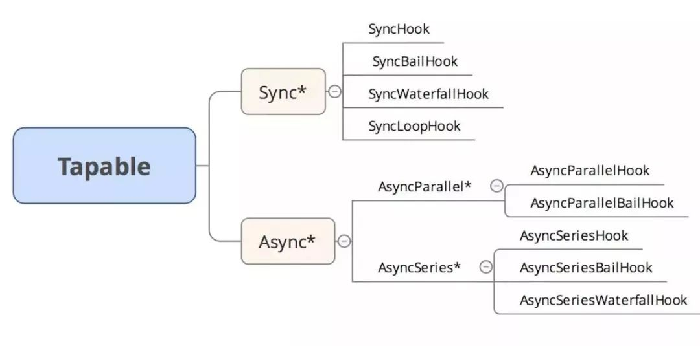

#### Webpack 事件流机制

- `Webpack`是基于事件流的插件集合，它的工作流程就是将各个插件串联起来，而实现这一切的核心就是`Tapable`，`Tapable`是一个类似`Node.js`的`EventEmitter`的库,主要是控制钩子函数的发布与订阅，控制着`webpack`的插件系统。`Webpack`中最核心的负责编译的`Compiler`和负责创建的捆绑包的`Compilation`都是`Tapable`实例。

- `Tapable`库暴露很多`Hook`类，为插件提供挂载的钩子。

  ```javascript
  const {
  	SyncHook,  // 同步钩子
  	SyncBailHook, // 同步熔断钩子
  	SyncWaterfallHook, // 同步流水钩子
  	SyncLoopHook, // 同步循环钩子
  	AsyncParallelHook, // 异步并发钩子
  	AsyncParallelBailHook, // 异步并发熔断钩子
  	AsyncSeriesHook, // 异步串行钩子
  	AsyncSeriesBailHook, // 异步串行熔断钩子
  	AsyncSeriesWaterfallHook // 异步串行流水钩子
   } = require("tapable");
  const hook = new SyncHook(["arg1", "arg2", "arg3"]);
  ```

  

- Tapable提供了同步和异步绑定钩子的方法，并且他们都有绑定事件以及执行事件对应的方法。

  ```tex
  Async*
  绑定: tapAsync/tapPromise/tap   执行: callAsync/promise
  Sync*
  绑定: tap                       执行: call
  ```

- Tapable使用实际例子:

  ```javascript
  const { SyncHook } = require("tapable");
  let queue = new SyncHook(['name']); //所有的构造函数都接收一个可选的参数，这个参数是一个字符串的数组。
  
  // 订阅
  queue.tap('1', function (name, name2) {// tap 的第一个参数是用来标识订阅的函数的
      console.log(name, name2, 1);
      return '1'
  });
  queue.tap('2', function (name) {
      console.log(name, 2);
  });
  queue.tap('3', function (name) {
      console.log(name, 3);
  });
  
  // 发布
  queue.call('webpack', 'webpack-cli');// 发布的时候触发订阅的函数 同时传入参数
  
  // 执行结果:
  /*
  webpack undefined 1 // 传入的参数需要和new实例的时候保持一致，否则获取不到多传的参数
  webpack 2
  webpack 3
  */
  ```

- Webpack中Tapable的应用：

  ```javascript
  if (Array.isArray(options)) {
  		compiler = new MultiCompiler(
  			Array.from(options).map(options => webpack(options))
  		);
  	} else if (typeof options === "object") {
  		// 1 做初始的操作
  		options = new WebpackOptionsDefaulter().process(options);
  		compiler = new Compiler(options.context);
  		compiler.options = options;
  		// 2  必须插件有apply接受compiler 参数
  		new NodeEnvironmentPlugin({
  			infrastructureLogging: options.infrastructureLogging
  		}).apply(compiler);
  		// 插件接收compiler对象上的hooks，议案事件触发，插件也会执行操作
  		if (options.plugins && Array.isArray(options.plugins)) {
  			for (const plugin of options.plugins) {
  				if (typeof plugin === "function") {
  					plugin.call(compiler, compiler);
  				} else {
  					plugin.apply(compiler);
  				}
  			}
  		}
  		compiler.hooks.environment.call();
  		compiler.hooks.afterEnvironment.call();
  		compiler.options = new WebpackOptionsApply().process(options, compiler);
  	}
  ```

#### Webpack 流程概览

- Webpack首先会把配置参数和命令行的参数及默认参数合并，并初始化需要使用的插件和配置插件等执行环境所需要的参数；初始化完成后会调用Compiler的run来真正启动webpack编译构建过程，webpack的构建流程包括`compile`、`make`、`build`、`seal`、`emit`阶段，执行完这些阶段就完成了构建过程。

1. **初始化参数**：从配置文件和 `Shell` 语句中读取与合并参数，得出最终的参数。
2. **开始编译**：根据我们的`webpack`配置注册好对应的插件调用 `compile.run` 进入编译阶段,在编译的第一阶段是 `compilation`，他会注册好不同类型的`module`对应的 `factory`，不然后面碰到了就不知道如何处理了。
3. **编译模块**：进入 `make` 阶段，会从 `entry` 开始进行两步操作：第一步是调用 `loaders` 对模块的原始代码进行编译，转换成标准的JS代码, 第二步是调用 `acorn` 对JS代码进行语法分析，然后收集其中的依赖关系。每个模块都会记录自己的依赖关系，从而形成一颗关系树。
4. **输出资源**：根据入口和模块之间的依赖关系，组装成一个个包含多个模块的 `Chunk`，再把每个 `Chunk` 转换成一个单独的文件加入到输出列表，这步是可以修改输出内容的最后机会。
5. **输出完成**：在确定好输出内容后，根据配置确定输出的路径和文件名，把文件内容写入到文件系统。

#### Webpack 流程图示


- Webpack 流程详解：

  - 分为三个阶段：「初始化阶段、编译阶段、输出文件阶段(`chunk`)」

    1. **初始化阶段**：

       - 初始化参数: 从配置文件和 `Shell` 语句中读取与合并参数，得出最终的参数。这个过程中还会执行配置文件中的插件实例化语句` new Plugin()`。
       - 初始化默认参数配置: `new WebpackOptionsDefaulter().process(options)`
       - 实例化`Compiler`对象:用上一步得到的参数初始化`Compiler`实例，`Compiler`负责文件监听和启动编译。`Compiler`实例中包含了完整的`Webpack`配置，全局只有一个`Compiler`实例。
       - 加载插件: 依次调用插件的`apply`方法，让插件可以监听后续的所有事件节点。同时给插件传入`compiler`实例的引用，以方便插件通过`compiler`调用`Webpack`提供的`API`。
       - 处理入口: 读取配置的`Entrys`，为每个`Entry`实例化一个对应的`EntryPlugin`，为后面该`Entry`的递归解析工作做准备。

       ```javascript
       new EntryOptionPlugin().apply(compiler)  
       new SingleEntryPlugin(context, item, name)  
       compiler.hooks.make.tapAsync
       ```

    2. **编译阶段**：

       - `run`阶段：启动一次新的编译。`this.hooks.run.callAsync`。
       - `compile`: 该事件是为了告诉插件一次新的编译将要启动，同时会给插件带上`compiler`对象。
       - `compilation`: 当`Webpack`以开发模式运行时，每当检测到文件变化，一次新的`Compilation`将被创建。一个`Compilation`对象包含了当前的模块资源、编译生成资源、变化的文件等。`Compilation`对象也提供了很多事件回调供插件做扩展。
       - `make`:一个新的 `Compilation` 创建完毕主开始编译  完毕主开始编译`this.hooks.make.callAsync`。
       - `addEntry`: 即将从 `Entry` 开始读取文件。
       - `_addModuleChain`: 根据依赖查找对应的工厂函数，并调用工厂函数的`create`来生成一个空的`MultModule`对象，并且把`MultModule`对象存入`compilation`的`modules`中后执行`MultModule.build`。
       - `buildModules`: 使用对应的`Loader`去转换一个模块。开始编译模块,`this.buildModule(module) ` ` buildModule(module, optional,origin,dependencies, thisCallback)`。
       - `build`: 开始真正编译模块。
       - `doBuild`: 开始真正编译入口模块。
       - `normal-module-loader`: 在用`Loader`对一个模块转换完后，使用`acorn`解析转换后的内容，输出对应的抽象语法树（`AST`），以方便`Webpack`后面对代码的分析。
       - `program`: 从配置的入口模块开始，分析其`AST`，当遇到`require`等导入其它模块语句时，便将其加入到依赖的模块列表，同时对新找出的依赖模块递归分析，最终搞清所有模块的依赖关系。

    3. **输出阶段**：

       - `seal`: 封装 `compilation.seal seal(callback)`。

       - `addChunk`: 生成资源 `addChunk(name)`。

       - `createChunkAssets`: 创建资源 `this.createChunkAssets()`。

       - `getRenderManifest`: 获得要渲染的描述文件 `getRenderManifest(options)`。

       - `render`: 渲染源码 `source = fileManifest.render()`。

       - `afterCompile`: 编译结束  `this.hooks.afterCompile`。

       - `shouldEmit`: 所有需要输出的文件已经生成好，询问插件哪些文件需要输出，哪些不需要。`this.hooks.shouldEmit`。

       - `emit`: 确定好要输出哪些文件后，执行文件输出，可以在这里获取和修改输出内容。

         ```javascript
         this.emitAssets(compilation)  
         this.hooks.emit.callAsync 
         const emitFiles = err 
         this.outputFileSystem.writeFile
         ```

       - `done`: 全部完成  `this.hooks.done.callAsync`。

#### Webpack 执行流程源码分析